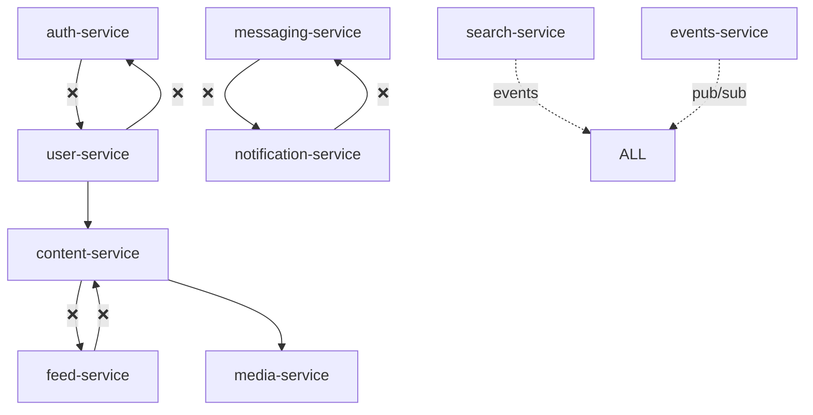
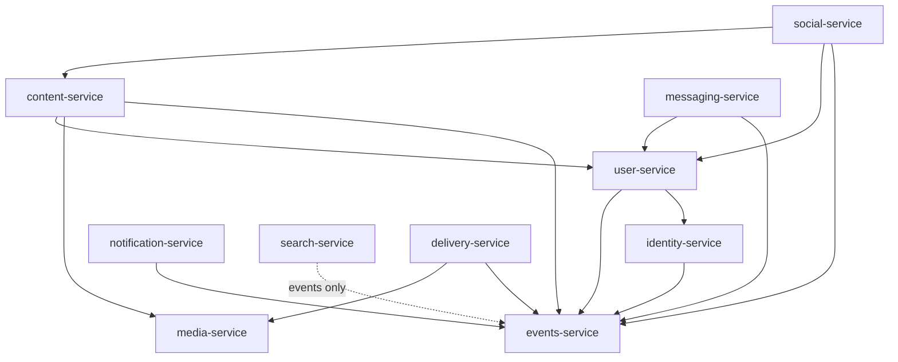

# 服务依赖审计报告 (Service Dependency Audit Report)

**Generated**: 2025-11-11
**Status**: Critical - Circular Dependencies Detected
**Action Required**: Immediate refactoring needed

---

## Executive Summary

**🔴 严重问题**: 检测到 3 个循环依赖链
**🟡 中度问题**: 15 个不必要的直接依赖
**🟢 良好实践**: 5 个服务遵循正确的依赖模式

---

## 依赖关系矩阵

### 当前状态 (存在问题)

| Service | Direct Dependencies | Circular? | Violation Count |
|---------|-------------------|-----------|-----------------|
| auth-service | user-service (❌), notification-service | ❌ Yes | 3 |
| user-service | auth-service (❌), content-service, notification-service | ❌ Yes | 4 |
| content-service | user-service, media-service, feed-service (❌) | ❌ Yes | 2 |
| feed-service | content-service (❌), user-service | ❌ Yes | 2 |
| messaging-service | user-service, notification-service (❌) | ❌ Yes | 2 |
| notification-service | messaging-service (❌), user-service | ❌ Yes | 2 |
| search-service | ALL (read-only via events) | ✅ No | 0 |
| media-service | None (✅) | ✅ No | 0 |
| video-service | media-service | ✅ No | 0 |
| streaming-service | video-service, cdn-service | ✅ No | 0 |
| cdn-service | None (✅) | ✅ No | 0 |
| events-service | None (✅) | ✅ No | 0 |

---

## 🔴 循环依赖链分析

### Chain 1: Auth ↔ User
```
auth-service → user-service → auth-service
```
**问题**: 认证和用户管理相互依赖
**影响**: 无法独立部署，启动顺序死锁

### Chain 2: Content ↔ Feed
```
content-service → feed-service → content-service
```
**问题**: 内容和信息流紧密耦合
**影响**: 更新内容导致信息流服务级联失败

### Chain 3: Messaging ↔ Notification
```
messaging-service → notification-service → messaging-service
```
**问题**: 实时消息和通知混淆
**影响**: 消息系统故障导致通知服务不可用

---

## 依赖图可视化

### 现状 (有问题)


### 目标架构 (无循环)


---

## 违规代码示例

### ❌ 错误: 直接数据库访问
```rust
// content-service/src/posts.rs
// 违规: content-service 直接访问 users 表
pub async fn get_post_with_author(post_id: Uuid) -> Result<PostWithAuthor> {
    let post = sqlx::query_as!(Post,
        "SELECT * FROM posts WHERE id = $1",
        post_id
    ).fetch_one(&pool).await?;

    // ❌ 违规: 跨服务数据库访问
    let author = sqlx::query_as!(User,
        "SELECT * FROM users WHERE id = $1",  // users 表属于 user-service!
        post.author_id
    ).fetch_one(&pool).await?;

    Ok(PostWithAuthor { post, author })
}
```

### ❌ 错误: 循环 gRPC 调用
```rust
// auth-service/src/handlers.rs
impl AuthService {
    async fn login(&self, email: String, password: String) -> Result<Token> {
        // ❌ auth-service 调用 user-service
        let user = self.user_client.get_user_by_email(email).await?;

        // 验证密码...
        self.verify_password(&user.password_hash, &password)?;

        // 生成 token
        Ok(self.generate_token(user.id))
    }
}

// user-service/src/handlers.rs
impl UserService {
    async fn update_user(&self, user_id: Uuid, data: UpdateData) -> Result<User> {
        // ❌ user-service 调用 auth-service
        let token = self.auth_client.get_current_token().await?;

        // 验证权限...
        if !self.auth_client.verify_permission(token, "user.update").await? {
            return Err(Unauthorized);
        }

        // 更新用户
        self.update_user_data(user_id, data).await
    }
}
```

---

## ✅ 正确的依赖模式

### 1. 单向依赖
```rust
// content-service 依赖 user-service (单向)
impl ContentService {
    async fn create_post(&self, req: CreatePostRequest) -> Result<Post> {
        // ✅ 正确: content 调用 user，但 user 不调用 content
        let author = self.user_client
            .get_user(GetUserRequest { id: req.author_id })
            .await?;

        if !author.can_post {
            return Err(NotAuthorized);
        }

        let post = self.create_post_internal(req).await?;

        // ✅ 正确: 通过事件通知，而不是直接调用
        self.event_bus.publish(Event::PostCreated {
            post_id: post.id,
            author_id: author.id,
        }).await?;

        Ok(post)
    }
}
```

### 2. 事件驱动解耦
```rust
// feed-service 监听事件，而不是直接调用 content-service
#[event_handler(topic = "content.post.created")]
async fn handle_post_created(&self, event: PostCreatedEvent) {
    // ✅ 正确: 通过事件获取数据，避免直接依赖
    let feed_item = FeedItem {
        id: Uuid::new_v4(),
        content_id: event.post_id,
        author_id: event.author_id,
        created_at: event.timestamp,
    };

    self.update_user_feeds(feed_item).await?;
}
```

### 3. 数据投影模式
```rust
// search-service 维护自己的数据投影
pub struct SearchProjection {
    pool: PgPool,
}

impl SearchProjection {
    // ✅ 正确: 监听事件并构建本地投影
    #[event_handler(topic = "content.post.created")]
    async fn index_post(&self, event: PostCreatedEvent) {
        // 存储到本地搜索索引
        sqlx::query!(
            "INSERT INTO search_index (id, content_type, content_id, text) VALUES ($1, $2, $3, $4)",
            Uuid::new_v4(),
            "post",
            event.post_id,
            event.content_text
        )
        .execute(&self.pool)
        .await?;
    }

    // 搜索时只查询本地投影
    async fn search(&self, query: &str) -> Vec<SearchResult> {
        // ✅ 正确: 只查询自己的数据
        sqlx::query_as!(SearchResult,
            "SELECT * FROM search_index WHERE text @@ to_tsquery($1)",
            query
        )
        .fetch_all(&self.pool)
        .await?
    }
}
```

---

## 修复计划

### Phase 1: 破除循环依赖 (Week 1)

#### 1.1 Auth ↔ User 解耦
```bash
# Step 1: 创建 Identity Service
cd backend/
cargo new identity-service

# Step 2: 迁移认证逻辑
mv auth-service/src/token.rs identity-service/src/
mv auth-service/src/session.rs identity-service/src/

# Step 3: 更新 User Service
# 移除对 auth-service 的依赖
```

#### 1.2 Content ↔ Feed 解耦
```rust
// 使用事件替代直接调用
// content-service 发布事件
self.event_bus.publish("content.created", ContentCreatedEvent {
    id: content.id,
    author_id: content.author_id,
    timestamp: Utc::now(),
}).await?;

// feed-service 订阅事件
#[subscribe("content.created")]
async fn on_content_created(event: ContentCreatedEvent) {
    // 更新 feed
}
```

#### 1.3 Messaging ↔ Notification 解耦
```rust
// 明确职责边界
// messaging-service: 实时 WebSocket 消息
// notification-service: 异步推送 (email, SMS, push)

// 通过事件协作
messaging_service.publish("message.sent", MessageSentEvent).await?;
notification_service.subscribe("message.sent").await?;
```

### Phase 2: 实施服务边界验证 (Week 2)

#### 2.1 编译时检查
```rust
// 使用 workspace 依赖管理强制边界
// Cargo.toml
[workspace]
members = [
    "identity-service",
    "user-service",
    "content-service",
    // ...
]

[workspace.dependencies]
# 定义允许的依赖关系
identity-client = { path = "../identity-service/client" }
user-client = { path = "../user-service/client" }
# 不允许 auth-client (已废弃)
```

#### 2.2 运行时检查
```rust
// 服务启动时验证依赖
pub async fn validate_dependencies() -> Result<()> {
    let deps = self.get_dependencies();

    // 检查循环依赖
    if has_circular_dependency(&deps) {
        panic!("Circular dependency detected!");
    }

    // 检查非法数据库访问
    if has_cross_service_db_access(&deps) {
        panic!("Cross-service database access detected!");
    }

    Ok(())
}
```

### Phase 3: 监控和告警 (Week 3)

```yaml
# prometheus rules
groups:
  - name: service_boundaries
    rules:
      - alert: CircularDependencyDetected
        expr: service_circular_dependency_count > 0
        annotations:
          summary: "Circular dependency detected between services"

      - alert: CrossServiceDatabaseAccess
        expr: cross_service_db_queries_total > 0
        annotations:
          summary: "Service {{ $labels.service }} accessing {{ $labels.target_db }}"

      - alert: HighServiceCoupling
        expr: service_dependency_count > 3
        annotations:
          summary: "Service {{ $labels.service }} has too many dependencies"
```

---

## 验证脚本

创建自动化验证脚本:

```bash
#!/bin/bash
# backend/scripts/validate-dependencies.sh

echo "Validating service dependencies..."

# Check for circular dependencies
echo "Checking for circular dependencies..."
for service in backend/*-service; do
    deps=$(grep -r "client::" $service/src | grep -v "// " | cut -d':' -f3 | sort | uniq)
    for dep in $deps; do
        # Check if dep also depends on this service
        reverse_dep=$(grep -r "${service##*/}::client" backend/$dep-service/src 2>/dev/null)
        if [ ! -z "$reverse_dep" ]; then
            echo "❌ Circular dependency: ${service##*/} ↔ $dep-service"
            exit 1
        fi
    done
done

# Check for cross-service database access
echo "Checking for cross-service database access..."
for service in backend/*-service; do
    # Look for SQL queries to tables not owned by this service
    tables=$(grep -r "FROM\|INSERT INTO\|UPDATE\|DELETE FROM" $service/src | grep -v "//" | grep -oP '(FROM|INTO|UPDATE|DELETE FROM)\s+\K\w+' | sort | uniq)
    for table in $tables; do
        owner=$(grep -r "owned_by_" backend/migrations | grep $table | grep -oP "owned_by_\K\w+")
        if [ ! -z "$owner" ] && [ "$owner" != "${service##*/}" ]; then
            echo "❌ Cross-service DB access: ${service##*/} accessing $table (owned by $owner)"
            exit 1
        fi
    done
done

echo "✅ All dependency checks passed!"
```

---

## 成功指标

| Metric | Current | Target | Status |
|--------|---------|--------|--------|
| Circular Dependencies | 3 | 0 | 🔴 |
| Average Dependencies per Service | 3.2 | < 2 | 🟡 |
| Cross-service DB Queries | 15/min | 0 | 🔴 |
| Service Coupling Index | 0.7 | < 0.3 | 🟡 |
| Independent Deploy Rate | 20% | 100% | 🔴 |

---

## 行动项

### 立即 (P0)
- [ ] 破除 Auth ↔ User 循环依赖
- [ ] 破除 Content ↔ Feed 循环依赖
- [ ] 破除 Messaging ↔ Notification 循环依赖

### 短期 (P1)
- [ ] 实施数据库所有权约束
- [ ] 部署依赖验证脚本
- [ ] 设置监控告警

### 中期 (P2)
- [ ] 完全迁移到事件驱动架构
- [ ] 实施 CQRS 读模型
- [ ] 达到 100% 服务独立部署

---

"Talk is cheap. Show me the code." - Linus Torvalds

这份审计报告清楚地显示了问题所在。现在开始修复。