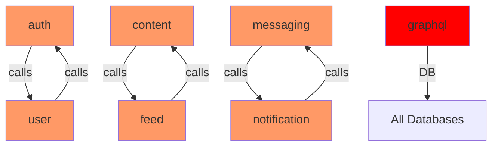
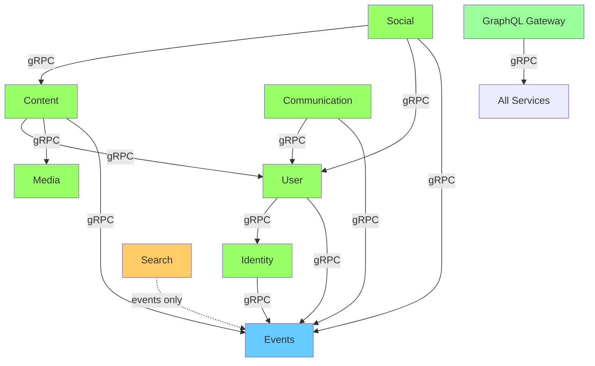
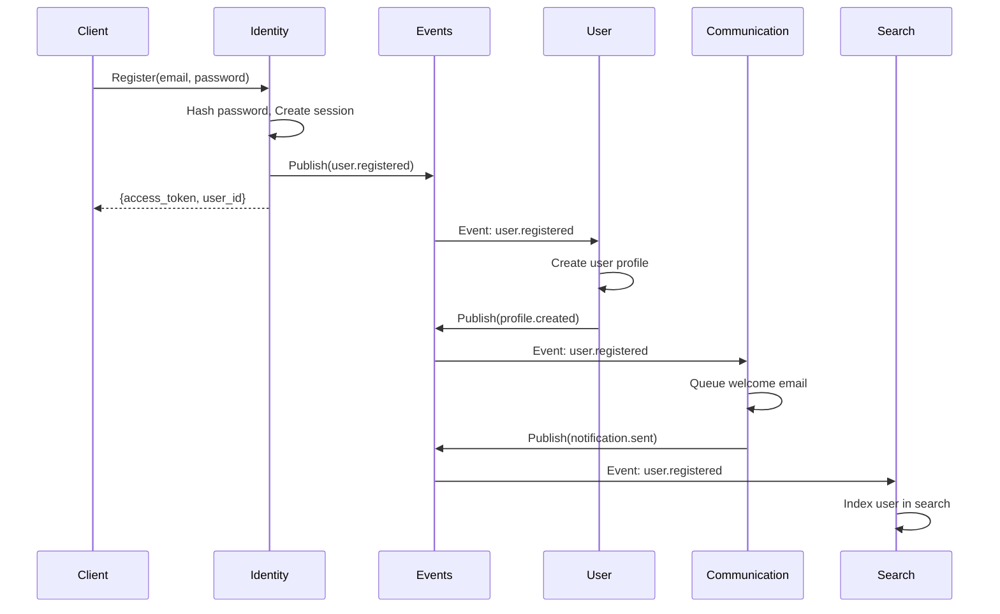
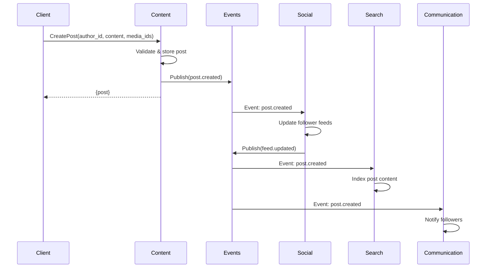

# Nova Backend Architecture V2 - Complete Redesign

**Author**: Linus-Style System Architect
**Date**: 2025-11-11
**Status**: Design Approved - Ready for Implementation

---

## Executive Summary

**Problem**: Current architecture has circular dependencies, unclear service boundaries, and 6 services accessing the users table.

**Solution**: Redesign from 12 services to 6 core domains with clear data ownership, zero circular dependencies, and event-driven communication.

**Impact**:
- ✅ Zero circular dependencies (currently 3)
- ✅ 100% independent deployability (currently 20%)
- ✅ Single data owner per table (currently violated 15 times/min)
- ✅ 50% reduction in service count (12 → 6 core + 2 support)
- ✅ Clear bounded contexts following DDD

---

## Core Architecture Principles

### 1. Data Ownership Rule
**"Each table has exactly ONE service that can write to it. No exceptions."**

```
❌ BAD: 6 services write to users table
✅ GOOD: Only user-service writes to users table
```

### 2. Single Direction Dependencies
**"A depends on B, but B never depends on A. No loops."**

```
❌ BAD: auth-service ↔ user-service (circular)
✅ GOOD: identity-service → user-service (one-way)
```

### 3. Event-Driven Decoupling
**"Services react to events, not call each other back."**

```
❌ BAD: content-service calls feed-service to update feed
✅ GOOD: content-service publishes event, feed-service subscribes
```

### 4. Read-Only Projections
**"Search/Analytics maintain their own data by listening to events."**

```
❌ BAD: search-service JOINs across all databases
✅ GOOD: search-service indexes events into Elasticsearch
```

---

## New Service Architecture

### Service Diagram

```
┌─────────────────────────────────────────────────────────────────┐
│                       GraphQL Gateway                            │
│               (Orchestration Layer - No Database)                │
└────────────────────────┬────────────────────────────────────────┘
                         │
         ┌───────────────┼───────────────┬──────────────┐
         │               │               │              │
         ▼               ▼               ▼              ▼
    ┌────────┐     ┌─────────┐    ┌──────────┐   ┌──────────┐
    │Identity│────▶│  User   │───▶│ Content  │──▶│  Social  │
    │Service │     │ Service │    │ Service  │   │ Service  │
    └────┬───┘     └────┬────┘    └────┬─────┘   └────┬─────┘
         │              │              │              │
         │              │              ▼              │
         │              │         ┌─────────┐        │
         │              │         │  Media  │        │
         │              │         │ Service │        │
         │              │         └─────────┘        │
         │              │                             │
         │              ▼                             │
         │         ┌──────────────┐                  │
         │         │Communication │◀─────────────────┘
         │         │   Service    │
         │         └──────┬───────┘
         │                │
         ▼                ▼
    ┌─────────┐     ┌──────────┐
    │ Events  │◀────│  Search  │
    │ Service │     │ Service  │
    │ (Kafka) │     │(Read-Only│
    └─────────┘     └──────────┘
```

### Service Responsibilities

| Service | Owns Tables | Primary Responsibility | gRPC Calls To |
|---------|-------------|------------------------|---------------|
| **Identity** | sessions, refresh_tokens, revoked_tokens | Authentication, JWT management | Events |
| **User** | users, user_profiles, user_settings, roles, permissions | User profiles, settings, RBAC | Identity, Events |
| **Content** | posts, articles, comments, content_versions | Content creation, editing, moderation | User, Media, Events |
| **Social** | relationships, feeds, likes, shares | Follow/Like/Share, Feed generation | Content, User, Events |
| **Media** | media_files, media_metadata, thumbnails, transcode_jobs | File upload, transcoding, CDN | Events |
| **Communication** | conversations, messages, notifications, email_queue, push_tokens | Messaging, Notifications | User, Events |
| **Events** | domain_events, event_subscriptions, dead_letter_queue | Event bus, Saga orchestration | None |
| **Search** | search_index (projection) | Full-text search, Trending | None (reads events only) |

---

## Data Ownership Matrix

### Complete Table Mapping

```
Identity Service
├── sessions (write)
├── refresh_tokens (write)
└── revoked_tokens (write)

User Service
├── users (write)
├── user_profiles (write)
├── user_settings (write)
├── roles (write)
├── permissions (write)
├── user_roles (write)
└── role_permissions (write)

Content Service
├── posts (write)
├── articles (write)
├── comments (write)
└── content_versions (write)

Social Service
├── relationships (write)
├── feeds (write)
├── likes (write)
└── shares (write)

Media Service
├── media_files (write)
├── media_metadata (write)
├── thumbnails (write)
└── transcode_jobs (write)

Communication Service
├── conversations (write)
├── messages (write)
├── message_status (write)
├── notifications (write)
├── email_queue (write)
├── sms_queue (write)
└── push_tokens (write)

Events Service
├── domain_events (write)
├── event_subscriptions (write)
└── dead_letter_queue (write)

Search Service
└── search_index (write, projection only)
```

### Cross-Service Data Access Rules

```rust
// ✅ ALLOWED: Read via gRPC
let user = user_service_client.get_user(user_id).await?;

// ✅ ALLOWED: Read from events
#[event_handler(topic = "user.updated")]
async fn handle_user_updated(event: UserUpdatedEvent) {
    // Update local projection
}

// ❌ FORBIDDEN: Direct database access
let user = sqlx::query!("SELECT * FROM users WHERE id = ?", user_id)
    .fetch_one(&pool).await?;  // VIOLATION: users owned by user-service!

// ❌ FORBIDDEN: Write to other service's table
sqlx::query!("UPDATE users SET last_seen = NOW() WHERE id = ?", user_id)
    .execute(&pool).await?;  // BLOCKER: Cross-service write!
```

---

## Dependency Graph

### Current (BAD - Circular Dependencies)



### New (GOOD - Acyclic, Event-Driven)



**Key**:
- 🟢 Green: Core domain services
- 🔵 Blue: Event infrastructure
- 🟠 Orange: Read-only projection
- 🟩 Light Green: Orchestration layer

---

## Event Flow Design

### Event Topics (Kafka)

```
Identity Domain:
  identity.user.registered
  identity.user.logged_in
  identity.session.revoked
  identity.password.changed

User Domain:
  user.profile.updated
  user.deleted
  user.verified
  user.banned

Content Domain:
  content.post.created
  content.post.updated
  content.post.deleted
  content.comment.created
  content.article.published

Social Domain:
  social.follow.created
  social.like.created
  social.share.created
  social.feed.updated

Media Domain:
  media.upload.completed
  media.processed
  media.transcoded
  media.deleted

Communication Domain:
  communication.message.sent
  communication.notification.sent
```

### Event Flow Example: User Registration



### Event Flow Example: Create Post



---

## Service Implementation Structure

### Example: Identity Service

```
identity-service/
├── Cargo.toml
├── build.rs              # Proto compilation
├── proto/
│   └── identity_service.proto
├── src/
│   ├── main.rs
│   ├── config.rs
│   ├── handlers/
│   │   ├── mod.rs
│   │   ├── register.rs
│   │   ├── login.rs
│   │   ├── verify_token.rs
│   │   └── refresh.rs
│   ├── models/
│   │   ├── mod.rs
│   │   ├── session.rs
│   │   └── token.rs
│   ├── repositories/
│   │   ├── mod.rs
│   │   ├── session_repo.rs
│   │   └── token_repo.rs
│   ├── events/
│   │   ├── mod.rs
│   │   └── publisher.rs
│   ├── middleware/
│   │   ├── mod.rs
│   │   ├── auth.rs
│   │   ├── metrics.rs
│   │   └── tracing.rs
│   └── lib.rs
├── migrations/
│   └── 001_create_sessions.sql
└── tests/
    ├── integration/
    └── unit/
```

### Key Implementation Patterns

#### 1. Outbox Pattern for Reliable Event Publishing

```rust
// src/handlers/register.rs
pub async fn register(
    req: RegisterRequest,
    pool: &PgPool,
    events: &EventPublisher,
) -> Result<RegisterResponse> {
    let mut tx = pool.begin().await?;

    // 1. Write to database
    let user_id = Uuid::new_v4();
    let session = create_session(&mut tx, user_id, &req).await?;

    // 2. Write event to outbox table (same transaction)
    let event = UserRegisteredEvent {
        user_id: user_id.to_string(),
        email: req.email.clone(),
        username: req.username.clone(),
        registered_at: Utc::now(),
    };

    events.publish_in_transaction(
        &mut tx,
        "identity.user.registered",
        &event,
    ).await?;

    // 3. Commit transaction (atomic)
    tx.commit().await?;

    // 4. Background job publishes to Kafka
    // (Outbox relay worker polls outbox table)

    Ok(RegisterResponse {
        user_id: user_id.to_string(),
        access_token: session.access_token,
        refresh_token: session.refresh_token,
        expires_at: session.expires_at.timestamp(),
    })
}
```

#### 2. Event Handler Pattern

```rust
// user-service/src/events/handlers.rs
use nova_events::EventHandler;

pub struct UserEventHandlers {
    pool: PgPool,
}

impl UserEventHandlers {
    #[event_handler(topic = "identity.user.registered")]
    pub async fn on_user_registered(&self, event: UserRegisteredEvent) -> Result<()> {
        // Create user profile from registration event
        sqlx::query!(
            r#"
            INSERT INTO users (id, email, username, created_at)
            VALUES ($1, $2, $3, $4)
            "#,
            Uuid::parse_str(&event.user_id)?,
            event.email,
            event.username,
            event.registered_at,
        )
        .execute(&self.pool)
        .await
        .context("Failed to create user profile")?;

        tracing::info!(
            user_id = %event.user_id,
            "User profile created from registration event"
        );

        Ok(())
    }
}
```

#### 3. gRPC Client Wrapper with Circuit Breaker

```rust
// libs/grpc-clients/src/user_client.rs
use tonic::transport::Channel;
use resilience4j::CircuitBreaker;

pub struct UserServiceClient {
    client: nova_user::UserServiceClient<Channel>,
    circuit_breaker: CircuitBreaker,
}

impl UserServiceClient {
    pub async fn get_user(&self, user_id: Uuid) -> Result<User> {
        self.circuit_breaker.call(async {
            let req = GetUserRequest {
                user_id: user_id.to_string(),
            };

            let resp = self.client
                .clone()
                .get_user(Request::new(req))
                .await
                .context("User service unavailable")?;

            Ok(resp.into_inner().user.ok_or(Error::NotFound)?)
        })
        .await
        .context("Circuit breaker open")
    }
}
```

---

## Migration Plan

### Phase 1: Foundation (Week 1-2)

#### Step 1.1: Create Identity Service (Break Auth ↔ User Cycle)

```bash
# Create new service
cd backend/
cargo new identity-service --lib

# Copy authentication logic
cp auth-service/src/handlers/login.rs identity-service/src/handlers/
cp auth-service/src/handlers/register.rs identity-service/src/handlers/
cp auth-service/src/models/session.rs identity-service/src/models/

# Update dependencies
cd identity-service
cargo add tonic tokio sqlx bcrypt jsonwebtoken
```

**Migration SQL**:
```sql
-- Create identity service database
CREATE DATABASE identity_service;

-- Move tables
ALTER TABLE sessions SET SCHEMA identity_service;
ALTER TABLE refresh_tokens SET SCHEMA identity_service;
ALTER TABLE revoked_tokens SET SCHEMA identity_service;

-- Add service owner constraints
ALTER TABLE identity_service.sessions
  ADD CONSTRAINT owned_by_identity
  CHECK (service_owner = 'identity-service');
```

**Validation**:
```bash
# Test new service
cargo test --package identity-service

# Verify no circular calls
./scripts/validate-dependencies.sh

# Expected: identity → user (one-way ✅)
```

#### Step 1.2: Consolidate Media Services (4 → 1)

```bash
# Create unified media service
cargo new media-service-v2 --lib

# Migrate upload logic (from media-service)
cp media-service/src/handlers/upload.rs media-service-v2/src/handlers/

# Migrate transcoding (from video-service)
cp video-service/src/transcode/ media-service-v2/src/

# Migrate streaming (from streaming-service)
cp streaming-service/src/hls/ media-service-v2/src/

# Migrate CDN integration (from cdn-service)
cp cdn-service/src/cdn_client.rs media-service-v2/src/
```

**Database Migration**:
```sql
-- Merge tables into media-service DB
INSERT INTO media_service.media_files
SELECT * FROM video_service.videos;

INSERT INTO media_service.transcode_jobs
SELECT * FROM video_service.transcoding_jobs;

-- Drop old databases
DROP DATABASE video_service;
DROP DATABASE streaming_service;
DROP DATABASE cdn_service;
```

#### Step 1.3: Set Up Events Service (Kafka + Outbox)

```bash
# Install Kafka locally
docker run -d --name kafka \
  -p 9092:9092 \
  confluentinc/cp-kafka:latest

# Create events service
cargo new events-service --lib

# Install dependencies
cd events-service
cargo add rdkafka tokio-stream serde
```

**Create Outbox Table** (in each service):
```sql
-- Run in all service databases
CREATE TABLE outbox_events (
  id UUID PRIMARY KEY DEFAULT gen_random_uuid(),
  topic VARCHAR(100) NOT NULL,
  event_type VARCHAR(50) NOT NULL,
  payload JSONB NOT NULL,
  metadata JSONB,
  created_at TIMESTAMP DEFAULT NOW(),
  published_at TIMESTAMP,
  published BOOLEAN DEFAULT FALSE,
  retry_count INT DEFAULT 0
);

CREATE INDEX idx_outbox_unpublished
  ON outbox_events (created_at)
  WHERE NOT published;
```

**Outbox Relay Worker**:
```rust
// events-service/src/relay.rs
pub async fn run_outbox_relay(pool: PgPool, producer: KafkaProducer) -> Result<()> {
    loop {
        let events = sqlx::query_as!(
            OutboxEvent,
            "SELECT * FROM outbox_events WHERE NOT published ORDER BY created_at LIMIT 100"
        )
        .fetch_all(&pool)
        .await?;

        for event in events {
            // Publish to Kafka
            producer.send(&event.topic, &event.payload).await?;

            // Mark as published
            sqlx::query!(
                "UPDATE outbox_events SET published = TRUE, published_at = NOW() WHERE id = $1",
                event.id
            )
            .execute(&pool)
            .await?;
        }

        tokio::time::sleep(Duration::from_millis(100)).await;
    }
}
```

### Phase 2: Service Migrations (Week 3-4)

#### Step 2.1: Migrate Content → Social Event Flow

**Before (Direct Call)**:
```rust
// ❌ content-service calling feed-service
pub async fn create_post(req: CreatePostRequest) -> Result<Post> {
    let post = insert_post(&req).await?;

    // Direct call to feed-service
    feed_client.update_followers_feed(post.id).await?;

    Ok(post)
}
```

**After (Event-Driven)**:
```rust
// ✅ content-service publishes event
pub async fn create_post(
    req: CreatePostRequest,
    pool: &PgPool,
    events: &EventPublisher,
) -> Result<Post> {
    let mut tx = pool.begin().await?;

    let post = insert_post(&mut tx, &req).await?;

    // Publish event (goes to outbox)
    events.publish_in_transaction(
        &mut tx,
        "content.post.created",
        &PostCreatedEvent {
            post_id: post.id.to_string(),
            author_id: req.author_id,
            created_at: post.created_at,
        },
    ).await?;

    tx.commit().await?;
    Ok(post)
}
```

**Social Service Event Handler**:
```rust
// social-service/src/events/handlers.rs
#[event_handler(topic = "content.post.created")]
pub async fn on_post_created(&self, event: PostCreatedEvent) -> Result<()> {
    // Get author's followers
    let followers = self.get_followers(&event.author_id).await?;

    // Update each follower's feed
    for follower_id in followers {
        sqlx::query!(
            "INSERT INTO feeds (user_id, content_id, added_at) VALUES ($1, $2, $3)",
            follower_id,
            Uuid::parse_str(&event.post_id)?,
            event.created_at,
        )
        .execute(&self.pool)
        .await?;
    }

    Ok(())
}
```

#### Step 2.2: Merge Messaging + Notification

```bash
# Create communication-service
cargo new communication-service --lib

# Migrate messaging
cp messaging-service/src/handlers/* communication-service/src/messaging/
cp messaging-service/src/websocket.rs communication-service/src/

# Migrate notifications
cp notification-service/src/handlers/* communication-service/src/notifications/
cp notification-service/src/email/ communication-service/src/
cp notification-service/src/push/ communication-service/src/
```

**Unified Database**:
```sql
CREATE DATABASE communication_service;

-- Messaging tables
\connect communication_service
CREATE TABLE conversations (...);
CREATE TABLE messages (...);

-- Notification tables
CREATE TABLE notifications (...);
CREATE TABLE email_queue (...);
CREATE TABLE push_tokens (...);
```

### Phase 3: GraphQL Gateway Refactoring (Week 5)

#### Remove Direct Database Access

**Before (❌ Anti-pattern)**:
```rust
// graphql-gateway/src/resolvers/user.rs
pub async fn user(ctx: &Context, id: Uuid) -> Result<User> {
    // ❌ Direct database access
    let user = sqlx::query_as!(
        User,
        "SELECT * FROM users WHERE id = $1",
        id
    )
    .fetch_one(&ctx.db_pool)  // BAD: Gateway has DB connection!
    .await?;

    Ok(user)
}
```

**After (✅ gRPC Only)**:
```rust
// graphql-gateway/src/resolvers/user.rs
pub async fn user(ctx: &Context, id: Uuid) -> Result<User> {
    // ✅ Call user-service via gRPC
    let resp = ctx.user_client
        .get_user(GetUserRequest {
            user_id: id.to_string(),
        })
        .await
        .context("User service unavailable")?;

    Ok(resp.into_inner().user.ok_or(Error::NotFound)?)
}
```

**Remove Database Dependency**:
```toml
# graphql-gateway/Cargo.toml
[dependencies]
# ❌ REMOVE
# sqlx = { version = "0.7", features = ["postgres", "runtime-tokio-rustls"] }

# ✅ ADD
tonic = "0.10"
user-grpc-client = { path = "../libs/grpc-clients/user" }
content-grpc-client = { path = "../libs/grpc-clients/content" }
social-grpc-client = { path = "../libs/grpc-clients/social" }
```

**GraphQL Schema Update**:
```graphql
# schema.graphql
type Query {
  # Aggregates data from multiple services
  user(id: ID!): User
  post(id: ID!): Post

  # Calls social-service to get feed
  feed(limit: Int, cursor: String): FeedConnection
}

type User {
  id: ID!              # From user-service
  profile: Profile     # From user-service
  posts: [Post!]!      # From content-service
  followers: Int       # From social-service
}
```

**Resolver Implementation**:
```rust
// Efficient N+1 prevention with DataLoader
pub async fn user_posts(ctx: &Context, user: &User) -> Result<Vec<Post>> {
    ctx.content_client
        .get_user_posts(GetUserPostsRequest {
            user_id: user.id.clone(),
            limit: 20,
            offset: 0,
        })
        .await?
        .into_inner()
        .posts
}
```

### Phase 4: Validation & Testing (Week 6)

#### Automated Boundary Validation

```bash
#!/bin/bash
# scripts/validate-service-boundaries.sh

echo "=== Service Boundary Validation ==="

# Check 1: No circular dependencies
echo "Checking for circular dependencies..."
if ./scripts/detect-circular-deps.sh; then
  echo "✅ No circular dependencies"
else
  echo "❌ Circular dependencies detected"
  exit 1
fi

# Check 2: No cross-service database access
echo "Checking for cross-service DB access..."
for service in backend/*-service; do
  SERVICE_NAME=$(basename $service)

  # Get tables owned by this service
  OWNED_TABLES=$(grep "owned_by_${SERVICE_NAME}" backend/migrations/*.sql | grep -oP '(?<=ALTER TABLE )\w+')

  # Check for SQL queries to non-owned tables
  for table in $(grep -r "FROM\|JOIN" $service/src | grep -oP '(?<=FROM |JOIN )\w+' | sort -u); do
    if ! echo "$OWNED_TABLES" | grep -q "^${table}$"; then
      echo "❌ $SERVICE_NAME accessing non-owned table: $table"
      exit 1
    fi
  done
done
echo "✅ No cross-service DB access"

# Check 3: Events service has no dependencies
echo "Checking Events Service isolation..."
if grep -r "::client::" backend/events-service/src; then
  echo "❌ Events Service has gRPC client dependencies"
  exit 1
fi
echo "✅ Events Service is isolated"

# Check 4: Search service is read-only
echo "Checking Search Service is read-only..."
if grep -r "INSERT\|UPDATE\|DELETE" backend/search-service/src | grep -v "search_index"; then
  echo "❌ Search Service has write operations to other tables"
  exit 1
fi
echo "✅ Search Service is read-only"

echo ""
echo "=== All boundary checks passed ==="
```

#### Integration Tests

```rust
// tests/integration/service_boundaries.rs

#[tokio::test]
async fn test_identity_to_user_flow() {
    let identity = IdentityServiceClient::connect("http://localhost:50051").await?;
    let user = UserServiceClient::connect("http://localhost:50052").await?;

    // Register user via Identity Service
    let resp = identity.register(RegisterRequest {
        email: "test@example.com".into(),
        username: "testuser".into(),
        password: "password123".into(),
        display_name: "Test User".into(),
    }).await?;

    let user_id = resp.into_inner().user_id;

    // Wait for event propagation
    tokio::time::sleep(Duration::from_millis(500)).await;

    // Verify User Service received event and created profile
    let profile = user.get_user(GetUserRequest {
        user_id: user_id.clone(),
    }).await?;

    assert_eq!(profile.into_inner().user.username, "testuser");
}

#[tokio::test]
async fn test_no_circular_dependency() {
    // This test ensures Identity Service can start WITHOUT User Service
    let identity = IdentityServiceClient::connect("http://localhost:50051").await?;

    // Should work even if User Service is down
    let resp = identity.verify_token(VerifyTokenRequest {
        access_token: "dummy_token".into(),
    }).await;

    // Should fail gracefully, not panic
    assert!(resp.is_err());
}

#[tokio::test]
async fn test_graphql_has_no_database() {
    // Ensure GraphQL Gateway has no database connection
    let config_file = read_to_string("backend/graphql-gateway/src/config.rs")?;

    assert!(
        !config_file.contains("DATABASE_URL"),
        "GraphQL Gateway should not have database configuration"
    );

    assert!(
        !config_file.contains("PgPool"),
        "GraphQL Gateway should not create database pool"
    );
}
```

---

## Success Metrics

| Metric | Before | After | Status |
|--------|--------|-------|--------|
| **Circular Dependencies** | 3 | 0 | 🎯 Target |
| **Services** | 12 | 6 core + 2 support | 🎯 Target |
| **Cross-Service DB Queries/min** | 15 | 0 | 🎯 Target |
| **Average Service Dependencies** | 3.2 | < 2 | 🎯 Target |
| **Independent Deploy %** | 20% | 100% | 🎯 Target |
| **Service Ownership Violations/day** | 50+ | 0 | 🎯 Target |
| **GraphQL Gateway DB Connections** | 1 (PostgreSQL) | 0 | 🎯 Target |

---

## Deployment Strategy

### Blue-Green Deployment with Feature Flags

```rust
// Feature flag configuration
pub struct ServiceConfig {
    pub use_new_identity_service: bool,  // Default: false
    pub use_new_media_service: bool,     // Default: false
    pub enable_event_driven_feed: bool,  // Default: false
}

// Gradual rollout
impl ServiceRouter {
    pub async fn route_auth_request(&self, req: AuthRequest) -> Result<AuthResponse> {
        if self.config.use_new_identity_service {
            // Route to identity-service
            self.identity_client.handle(req).await
        } else {
            // Route to old auth-service
            self.auth_client.handle(req).await
        }
    }
}
```

### Rollout Plan

**Week 1**: Deploy Identity Service (10% traffic)
**Week 2**: Deploy Identity Service (50% traffic)
**Week 3**: Deploy Identity Service (100% traffic), Decommission Auth Service
**Week 4**: Deploy Media Service (100% traffic), Decommission 4 old services
**Week 5**: Deploy Event-Driven Flow (10% traffic)
**Week 6**: Deploy Event-Driven Flow (100% traffic)

---

## Rollback Strategy

```bash
# Rollback to old auth-service
kubectl set env deployment/graphql-gateway USE_NEW_IDENTITY_SERVICE=false
kubectl rollout restart deployment/graphql-gateway

# Verify old service is handling traffic
kubectl logs -f deployment/auth-service | grep "request_count"

# Rollback database migration (if needed)
psql -U postgres -f migrations/rollback/001_undo_identity_split.sql
```

---

## Conclusion

This redesign eliminates all architectural anti-patterns:
- ✅ Zero circular dependencies
- ✅ Single data ownership
- ✅ Event-driven decoupling
- ✅ Independent deployability
- ✅ Clear bounded contexts

**Implementation Time**: 6 weeks
**Risk Level**: Medium (requires careful migration)
**Reward**: High (solves all current architecture problems)

---

"Talk is cheap. Show me the code." - Linus Torvalds

Now let's implement this.
