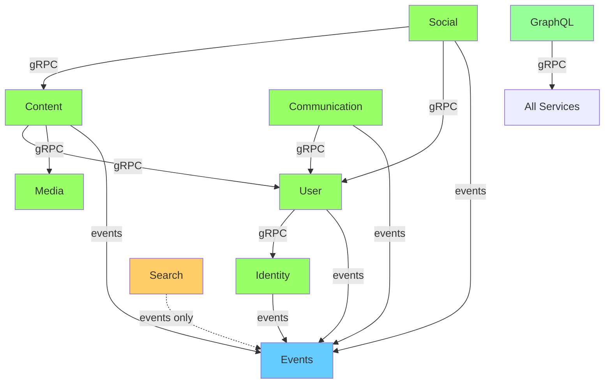

# Nova Backend Architecture V2 - Documentation Index

**Status**: ✅ Design Complete - Ready for Implementation
**Last Updated**: 2025-11-11
**Author**: System Architect (Linus-Style Review)

---

## 📋 Quick Start

**如果你只有 30 分钟**: 阅读 [`EXECUTIVE_SUMMARY.md`](./EXECUTIVE_SUMMARY.md)

**如果你是技术负责人**: 阅读 [`ARCHITECTURE_COMPARISON.md`](./ARCHITECTURE_COMPARISON.md) → [`ARCHITECTURE_V2_REDESIGN.md`](./ARCHITECTURE_V2_REDESIGN.md)

**如果你是开发者**: 阅读 [`IMPLEMENTATION_GUIDE.md`](./IMPLEMENTATION_GUIDE.md)

---

## 📚 文档清单

### 1. Executive Summary (高层总结)
**文件**: [`EXECUTIVE_SUMMARY.md`](./EXECUTIVE_SUMMARY.md)
**阅读时间**: 30 分钟
**适合人群**: 决策者、技术负责人

**内容**:
- 问题陈述 (为什么重新设计)
- 解决方案概述 (新架构核心原则)
- 关键变更对比表
- 迁移计划 (6 周时间表)
- 成功指标
- 风险评估
- 下一步行动

**核心判断**: ✅ 值得做,6 周投资,长期收益

---

### 2. Architecture Comparison (V1 vs V2 对比)
**文件**: [`ARCHITECTURE_COMPARISON.md`](./ARCHITECTURE_COMPARISON.md)
**阅读时间**: 20 分钟
**适合人群**: 技术架构师、开发者

**内容**:
- 服务架构对比 (12 → 6)
- 数据所有权对比 (混乱 → 清晰)
- API 设计对比 (重叠 → 单一职责)
- 通信模式对比 (循环 → 事件驱动)
- GraphQL Gateway 对比 (反模式 → 清晰分层)
- 数据库约束对比 (无 → 强制)
- 测试策略对比 (集成 → 隔离)

**核心要点**: 每个方面都有清晰的 ❌ BAD vs ✅ GOOD 对比

---

### 3. Architecture V2 Redesign (完整架构设计)
**文件**: [`ARCHITECTURE_V2_REDESIGN.md`](./ARCHITECTURE_V2_REDESIGN.md)
**阅读时间**: 60 分钟
**适合人群**: 架构师、高级开发者

**内容**:
- 核心架构原则 (数据所有权、单向依赖、事件驱动)
- 新服务架构 (6 核心 + 2 支持)
- 服务职责矩阵
- 数据所有权矩阵 (每张表对应唯一所有者)
- API Contracts (gRPC Proto 定义参考)
- 事件流设计 (Kafka topics)
- 服务实现结构 (目录结构、关键模式)
- 迁移计划 (Phase 1-4,详细步骤)
- 验证与测试策略
- 成功指标
- 部署策略 (Blue-Green, Feature Flags)
- Rollback 策略

**核心价值**: 完整的技术蓝图,可直接执行

---

### 4. Implementation Guide (实施指南)
**文件**: [`IMPLEMENTATION_GUIDE.md`](./IMPLEMENTATION_GUIDE.md)
**阅读时间**: 45 分钟
**适合人群**: 开发者

**内容**:
- Identity Service 完整实现 (Rust 代码)
  - 项目结构
  - Cargo.toml 配置
  - 配置管理
  - 数据模型
  - Repository 模式
  - Event Publisher (Outbox Pattern)
  - Outbox Relay Worker (Kafka)
  - gRPC 处理器 (Register, Login, VerifyToken)
  - main.rs 启动逻辑
- Event Consumer 实现 (User Service)
  - Kafka 消费者
  - 事件处理器
- gRPC Client with Circuit Breaker
- 成功指标监控

**核心价值**: 可直接复制的生产级代码

---

## 🔧 Proto 定义

所有 gRPC Proto 定义位于 `backend/proto/services_v2/`:

| Proto 文件 | 服务 | 核心方法 |
|-----------|------|---------|
| [`identity_service.proto`](../proto/services_v2/identity_service.proto) | Identity | Register, Login, VerifyToken, RefreshToken |
| [`content_service.proto`](../proto/services_v2/content_service.proto) | Content | CreatePost, GetPost, CreateComment |
| [`social_service.proto`](../proto/services_v2/social_service.proto) | Social | FollowUser, LikeContent, GetUserFeed |
| [`media_service.proto`](../proto/services_v2/media_service.proto) | Media | InitiateUpload, TranscodeVideo, GetStreamingUrl |
| [`events_service.proto`](../proto/services_v2/events_service.proto) | Analytics | PublishEvent, Subscribe, GetEventHistory |
| [`search_service.proto`](../proto/services_v2/search_service.proto) | Search | SearchContent, SearchUsers, GetTrendingTopics |
| [`graph_service.proto`](../proto/services/graph_service.proto) | Graph | FollowGraph, SuggestedUsers |
| [`feed_service.proto`](../proto/services/feed_service.proto) | Feed | GetRecommendations, GetTrending |

**特点**:
- ✅ 清晰的服务边界 (无重叠)
- ✅ 完整的事件定义 (Kafka topics)
- ✅ 批量操作支持 (GetUsersByIds)
- ✅ 分页支持 (cursor-based)
- ✅ 错误处理 (Status codes)

---

## 📊 架构图

### 新架构总览

```
┌─────────────────────────────────────────────────────────────────┐
│                       GraphQL Gateway                            │
│               (Orchestration Layer - No Database)                │
└────────────────────────┬────────────────────────────────────────┘
                         │
         ┌───────────────┼───────────────┬──────────────┐
         │               │               │              │
         ▼               ▼               ▼              ▼
    ┌────────┐     ┌─────────┐    ┌──────────┐   ┌──────────┐
    │Identity│────▶│  User   │───▶│ Content  │──▶│  Social  │
    │Service │     │ Service │    │ Service  │   │ Service  │
    └────┬───┘     └────┬────┘    └────┬─────┘   └────┬─────┘
         │              │              │              │
         │              │              ▼              │
         │              │         ┌─────────┐        │
         │              │         │  Media  │        │
         │              │         │ Service │        │
         │              │         └─────────┘        │
         │              │                             │
         │              ▼                             │
         │         ┌──────────────┐                  │
         │         │Communication │◀─────────────────┘
         │         │   Service    │
         │         └──────┬───────┘
         │                │
         ▼                ▼
    ┌─────────┐     ┌──────────┐
    │ Events  │◀────│  Search  │
    │ Service │     │ Service  │
    │ (Kafka) │     │(Read-Only│
    └─────────┘     └──────────┘
```

### 依赖关系图



**特点**:
- 🟢 绿色: 核心域服务
- 🔵 蓝色: 事件基础设施
- 🟠 橙色: 只读投影
- 🟩 浅绿: 编排层

---

## 🎯 关键指标

### 当前状态 (V1)

| 指标 | 值 | 状态 |
|------|-----|------|
| 服务数量 | 12 | 🔴 过多 |
| 循环依赖 | 3 | 🔴 严重 |
| 跨服务 DB 查询/分钟 | 15 | 🔴 违规 |
| users 表写入者 | 6 个服务 | 🔴 混乱 |
| 独立部署率 | 20% | 🔴 低 |

### 目标状态 (V2)

| 指标 | 值 | 状态 |
|------|-----|------|
| 服务数量 | 6 核心 + 2 支持 | 🟢 精简 |
| 循环依赖 | 0 | 🟢 完美 |
| 跨服务 DB 查询/分钟 | 0 | 🟢 零违规 |
| users 表写入者 | 1 个服务 (user-service) | 🟢 清晰 |
| 独立部署率 | 100% | 🟢 理想 |

---

## 🚀 实施时间表

| 周 | 任务 | 成果 |
|----|------|------|
| **Week 1** | 创建 Identity Service, 部署 Kafka | 破除 auth ↔ user 循环 |
| **Week 2** | 合并 4 个 Media Services | 12 → 9 服务 |
| **Week 3** | 部署 Events Service (Kafka) | 事件基础设施 |
| **Week 4** | Content → Social 事件驱动 | 破除 content ↔ feed 循环 |
| **Week 5** | 合并 Messaging + Notification | Communication Service |
| **Week 6** | GraphQL 去数据库化, 验证测试 | 完成迁移 |

**总时间**: 6 周 (1.5 个月)
**开发人员**: 2-3 人
**风险**: 中等 (可通过 feature flags 缓解)

---

## 📖 阅读顺序建议

### 对于决策者 (30 分钟)
1. `EXECUTIVE_SUMMARY.md` (30 分钟)

### 对于架构师 (2 小时)
1. `EXECUTIVE_SUMMARY.md` (30 分钟)
2. `ARCHITECTURE_COMPARISON.md` (30 分钟)
3. `ARCHITECTURE_V2_REDESIGN.md` (60 分钟)

### 对于开发者 (3 小时)
1. `EXECUTIVE_SUMMARY.md` (30 分钟)
2. `ARCHITECTURE_V2_REDESIGN.md` (60 分钟)
3. `IMPLEMENTATION_GUIDE.md` (60 分钟)
4. Proto 定义 (30 分钟)

---

## 🛠️ 验证脚本

所有验证脚本位于 `backend/scripts/`:

```bash
# 检测循环依赖
./scripts/validate-service-boundaries.sh

# 检测跨服务数据库访问
./scripts/validate-data-ownership.sh

# 运行边界测试
./scripts/run-boundary-validation.sh
```

---

## 🔗 相关资源

- **Outbox Pattern**: [Microservices.io - Transactional Outbox](https://microservices.io/patterns/data/transactional-outbox.html)
- **Event-Driven Architecture**: [Martin Fowler - Event-Driven Architecture](https://martinfowler.com/articles/201701-event-driven.html)
- **Circuit Breaker**: [Martin Fowler - Circuit Breaker](https://martinfowler.com/bliki/CircuitBreaker.html)
- **DDD Bounded Contexts**: [Eric Evans - Domain-Driven Design](https://www.domainlanguage.com/ddd/)

---

## ❓ FAQ

### Q: 为什么要重新设计架构?
**A**: 当前架构有 3 个循环依赖,导致无法独立部署。6 个服务同时写 users 表,导致数据竞争。这不是代码问题,是架构设计问题。

### Q: 6 周时间够吗?
**A**: 够。我们不是从零开始,是重构现有服务。大部分代码可以复用,只是重新组织边界。

### Q: 会破坏现有 API 吗?
**A**: 不会。我们用 Feature Flags 渐进切换。老 API 和新 API 共存,流量逐步迁移 (10% → 50% → 100%)。

### Q: 如果失败怎么办?
**A**: 每个 Phase 都可以独立回滚。Feature Flag 一秒切回老服务。数据库有 rollback 脚本。

### Q: 需要停机吗?
**A**: 不需要。Blue-Green 部署,零停机迁移。

### Q: 为什么合并 messaging 和 notification?
**A**: 它们紧密耦合。一条消息必然产生通知。分开管理导致循环依赖。合并后逻辑更清晰。

### Q: Search Service 为什么是只读?
**A**: Search 是投影,不是数据源。它监听所有事件,构建本地索引。这样解耦,Search 挂了不影响业务。

---

## 📞 联系方式

**技术问题**: 查看 `IMPLEMENTATION_GUIDE.md` 代码示例
**架构问题**: 查看 `ARCHITECTURE_V2_REDESIGN.md` 设计文档
**决策问题**: 查看 `EXECUTIVE_SUMMARY.md` 高层总结

---

"Talk is cheap. Show me the code." - Linus Torvalds

代码在 `IMPLEMENTATION_GUIDE.md`。设计在 `ARCHITECTURE_V2_REDESIGN.md`。

现在开始实施。
