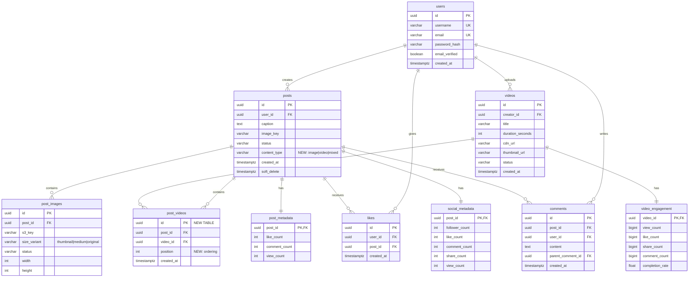
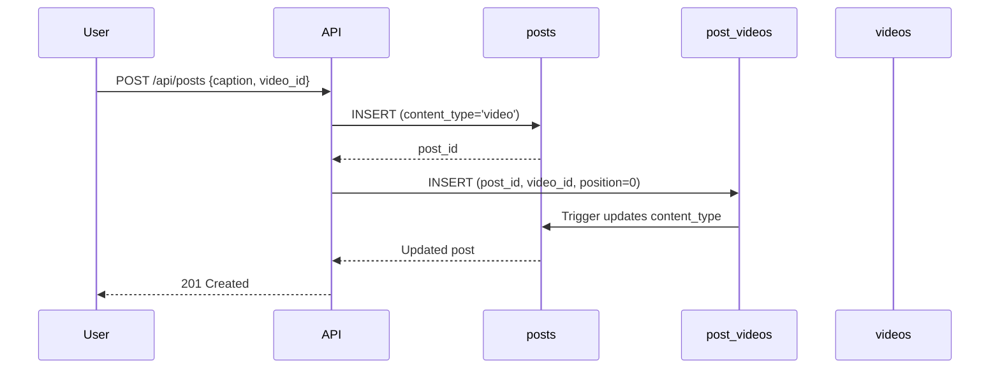

# Post-Video Association ERD

## Entity Relationship Diagram



## Key Changes Highlighted

### 🆕 New Entities

1. **`post_videos`** (Junction Table)
   - Links posts to videos with positioning
   - Enables multiple videos per post
   - Supports future carousel/playlist features

2. **`posts.content_type`** (New Column)
   - Distinguishes post types: `'image'`, `'video'`, `'mixed'`
   - Auto-updated by triggers based on attachments

### 🔗 Relationship Details

| From | To | Cardinality | On Delete |
|------|-----|-------------|-----------|
| `posts` | `post_videos` | 1:N | CASCADE |
| `videos` | `post_videos` | 1:N | CASCADE |
| `post_videos` | `videos` | N:1 | CASCADE |
| `post_videos` | `posts` | N:1 | CASCADE |

### 🎯 Design Patterns

**Pattern 1: Polymorphic Attachments (Simplified)**
```
posts (container)
  ├── post_images[] (image attachments)
  └── post_videos[] (video attachments)
```

**Pattern 2: Position-Based Ordering**
```sql
-- Videos rendered in order: 0, 1, 2, ...
SELECT * FROM post_videos
WHERE post_id = $1
ORDER BY position ASC;
```

**Pattern 3: Engagement Stays at Post Level**
```
User likes/comments → post (not individual videos)
Video engagement → tracked separately in video_engagement
```

---

## Data Flow Examples

### Creating a Video Post



### Retrieving Feed with Mixed Content

```mermaid
sequenceDiagram
    participant Client
    participant API
    participant get_post_with_media()
    participant DB

    Client->>API: GET /api/feed
    API->>get_post_with_media(): Call for each post
    get_post_with_media()->>DB: JOIN posts+post_images+post_videos+videos
    DB-->>get_post_with_media(): Aggregated JSONB
    get_post_with_media()-->>API: {images: [], videos: []}
    API-->>Client: Feed with mixed content
```

---

## Index Strategy

### Composite Indexes for Common Queries

```sql
-- Query: "Show me all video posts from user X"
CREATE INDEX idx_posts_user_content_type
ON posts(user_id, content_type, created_at DESC)
WHERE soft_delete IS NULL;

-- Query: "Get all videos in a post, ordered"
CREATE INDEX idx_post_videos_post_position
ON post_videos(post_id, position);

-- Query: "Find posts containing a specific video"
CREATE INDEX idx_post_videos_video_id
ON post_videos(video_id);
```

### Query Performance

| Query | Index Used | Rows Scanned |
|-------|-----------|--------------|
| User's video posts | `idx_posts_user_content_type` | O(user's posts) |
| Videos in a post | `idx_post_videos_post_position` | O(videos per post) |
| Posts with video X | `idx_post_videos_video_id` | O(posts with video) |

---

## Comparison: Before vs After

### Before Migration 027

```
┌─────────┐         ┌──────────┐
│  posts  │         │  videos  │
│ (images │         │ (isolated│
│  only)  │         │  content)│
└─────────┘         └──────────┘
     │                    │
     ├─ post_images       ├─ video_engagement
     ├─ likes             │
     └─ comments          (no social features)
```

**Issues**:
- Cannot post videos through main feed
- Videos lack social engagement (likes/comments)
- Inconsistent content model

### After Migration 027

```
┌──────────────────────────────────┐
│             posts                │
│  (unified content container)     │
│  content_type: image|video|mixed │
└──────────────────────────────────┘
     │
     ├─ post_images (images)
     ├─ post_videos (videos) ← NEW
     ├─ likes (unified)
     └─ comments (unified)

┌──────────┐
│  videos  │ (video metadata)
└──────────┘
     │
     └─ video_engagement (analytics)
```

**Benefits**:
- ✅ Videos integrated into main feed
- ✅ Consistent engagement model
- ✅ Supports mixed content (images + videos)
- ✅ Backward compatible with existing posts
