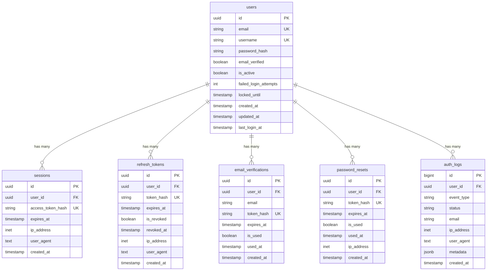

# Phase 0 架构文档 - 项目结构

## 项目目录树

```
nova/
├── .env.example                       # 环境变量模板
├── .github/
│   └── workflows/
│       └── ci.yml                     # GitHub Actions CI/CD
├── Makefile                           # 开发工具命令
├── docker-compose.yml                 # 本地开发环境
├── PHASE_0_SUMMARY.md                 # Phase 0 完成报告
│
├── backend/
│   ├── Cargo.toml                     # Workspace 配置
│   ├── Cargo.lock                     # 依赖锁定
│   ├── Dockerfile                     # 多阶段生产构建
│   ├── .dockerignore                  # Docker 构建排除
│   ├── .gitignore                     # Git 忽略规则
│   ├── README.md                      # 后端文档
│   │
│   ├── migrations/                    # 数据库迁移
│   │   ├── 001_initial_schema.sql    # 5 个核心表
│   │   └── 002_add_auth_logs.sql     # 审计日志
│   │
│   └── user-service/
│       ├── Cargo.toml                 # 服务依赖
│       └── src/
│           ├── main.rs                # 应用入口 (Actix-web 服务器)
│           ├── lib.rs                 # 库入口
│           ├── config.rs              # 配置管理
│           ├── error.rs               # 错误处理
│           │
│           ├── db/
│           │   └── mod.rs             # 数据库连接池 + 迁移
│           │
│           ├── handlers/              # HTTP 处理器
│           │   ├── mod.rs
│           │   ├── health.rs          # 健康检查
│           │   ├── users.rs           # 用户资料
│           │   ├── relationships.rs   # 用户关系
│           │   ├── preferences.rs     # 偏好设定
│           │   ├── moderation.rs      # 社群治理
│           │   └── events.rs          # 事件回调
│           │
│           ├── middleware/            # 中间件
│           │   └── mod.rs
│           │
│           ├── models/                # 数据模型
│           │   └── mod.rs             # User, Session, RefreshToken, etc.
│           │
│           ├── services/              # 业务逻辑层
│           │   └── mod.rs
│           │
│           └── utils/                 # 工具函数
│               └── mod.rs
│
└── docs/
    └── architecture/
        └── phase-0-structure.md       # 本文档
```

## 代码统计

| 类型 | 文件数 | 代码行数 |
|------|--------|----------|
| Rust 源代码 | 12 | 669 |
| SQL 迁移 | 2 | 345 |
| 配置文件 | 5 | ~300 |
| Docker 文件 | 2 | ~150 |
| CI/CD 工作流 | 1 | ~150 |
| 文档 | 2 | ~600 |
| **总计** | **24** | **~2,214** |

## 架构分层

```
┌─────────────────────────────────────────────────────┐
│              Actix-web HTTP Server                  │
│  (CORS, Logging, Tracing, Health Checks)           │
└─────────────────────────────────────────────────────┘
                        ▼
┌─────────────────────────────────────────────────────┐
│                  Handlers Layer                      │
│  (Health, Users, Relationships, Preferences)        │
└─────────────────────────────────────────────────────┘
                        ▼
┌─────────────────────────────────────────────────────┐
│                 Services Layer                       │
│  (Business Logic - Phase 1+)                        │
└─────────────────────────────────────────────────────┘
                        ▼
┌──────────────────┬──────────────────┬───────────────┐
│  Database Layer  │   Cache Layer    │  Email Layer  │
│   (PostgreSQL)   │    (Redis)       │   (SMTP)      │
│   sqlx + Pool    │ Connection Mgr   │   Lettre      │
└──────────────────┴──────────────────┴───────────────┘
```

## 数据库 Schema 图



## 请求流程图

```
Client Request
     │
     ▼
┌─────────────────┐
│  Actix-web      │
│  Middleware:    │
│  - CORS         │
│  - Logging      │
│  - Tracing      │
└─────────────────┘
     │
     ▼
┌─────────────────┐
│  Router         │
│  /api/v1/*      │
└─────────────────┘
     │
     ├──────────────────────────────┐
     │                              │
     ▼                              ▼
┌──────────────┐          ┌──────────────────┐
│  Health      │          │  Auth (Phase 1+) │
│  Handlers    │          │  Handlers        │
└──────────────┘          └──────────────────┘
     │                              │
     ▼                              ▼
┌──────────────┐          ┌──────────────────┐
│  PostgreSQL  │          │  Services +      │
│  Pool Query  │          │  Redis Cache     │
└──────────────┘          └──────────────────┘
     │                              │
     ▼                              ▼
┌─────────────────────────────────────┐
│  JSON Response                       │
│  {status, data, error}              │
└─────────────────────────────────────┘
```

## Docker 容器架构

```
┌──────────────────────────────────────────────────┐
│            Docker Compose Network                │
│                  (nova-network)                  │
│                                                  │
│  ┌──────────────┐  ┌──────────────┐            │
│  │  PostgreSQL  │  │    Redis     │            │
│  │     :5432    │  │    :6379     │            │
│  │              │  │              │            │
│  │  Volume:     │  │  Volume:     │            │
│  │  postgres_   │  │  redis_data  │            │
│  │  data        │  │              │            │
│  └──────────────┘  └──────────────┘            │
│         ▲                 ▲                     │
│         │                 │                     │
│         └────────┬────────┘                     │
│                  │                              │
│         ┌────────▼─────────┐                   │
│         │  User Service    │                   │
│         │     :8080        │                   │
│         │  (Rust Actix)    │                   │
│         │                  │                   │
│         │  Health: /health │                   │
│         └──────────────────┘                   │
│                  │                              │
│         ┌────────▼─────────┐                   │
│         │    MailHog       │                   │
│         │  SMTP :1025      │                   │
│         │  Web  :8025      │                   │
│         └──────────────────┘                   │
│                                                  │
└──────────────────────────────────────────────────┘
              │
              ▼
        Host: localhost
        Ports: 8080, 5432, 6379, 8025
```

## 环境变量流程

```
.env.example
    │
    ▼
  .env (local)
    │
    ├──────────────────┐
    │                  │
    ▼                  ▼
docker-compose.yml   src/config.rs
    │                  │
    ▼                  ▼
Container Env      Config Struct
    │                  │
    └────────┬─────────┘
             │
             ▼
      Application Runtime
```

## CI/CD 流程图

```
Git Push/PR
     │
     ▼
┌─────────────────────────────────────┐
│     GitHub Actions Workflow         │
└─────────────────────────────────────┘
     │
     ├──────────────┬──────────────┬─────────────┐
     │              │              │             │
     ▼              ▼              ▼             ▼
┌─────────┐   ┌──────────┐   ┌─────────┐  ┌──────────┐
│  Lint   │   │  Test    │   │ Security│  │  Build   │
│         │   │          │   │ Audit   │  │  Docker  │
│ rustfmt │   │ cargo    │   │         │  │  Image   │
│ clippy  │   │ test     │   │ cargo   │  │          │
│         │   │          │   │ audit   │  │          │
│         │   │ +        │   │         │  │          │
│         │   │ coverage │   │         │  │          │
└─────────┘   └──────────┘   └─────────┘  └──────────┘
     │              │              │             │
     └──────┬───────┴──────────────┴─────────────┘
            │
            ▼
       All Pass?
            │
            ├── Yes ──▶ Push to Docker Hub
            │
            └── No ───▶ Fail CI (Block PR)
```

## 技术栈版本

| 组件 | 版本 | 用途 |
|------|------|------|
| Rust | 1.76+ | 系统编程语言 |
| Actix-web | 4.5 | Web 框架 |
| PostgreSQL | 14 | 主数据库 |
| Redis | 7 | 缓存和会话 |
| Docker | Latest | 容器化 |
| sqlx | 0.7 | 数据库工具 |
| Tokio | 1.36 | 异步运行时 |
| Argon2 | 0.5 | 密码哈希 |
| jsonwebtoken | 9.2 | JWT 处理 |

## 安全层次

```
┌──────────────────────────────────────┐
│  Network Security                    │
│  - HTTPS/TLS (生产环境)             │
│  - Firewall rules                    │
└──────────────────────────────────────┘
             │
             ▼
┌──────────────────────────────────────┐
│  Application Security                │
│  - JWT authentication                │
│  - Rate limiting (Governor)          │
│  - CORS middleware                   │
│  - Input validation (validator)      │
└──────────────────────────────────────┘
             │
             ▼
┌──────────────────────────────────────┐
│  Data Security                       │
│  - Argon2 password hashing           │
│  - SHA256 token hashing              │
│  - Database constraints              │
│  - Encrypted connections             │
└──────────────────────────────────────┘
             │
             ▼
┌──────────────────────────────────────┐
│  Audit & Monitoring                  │
│  - auth_logs table                   │
│  - Tracing middleware                │
│  - Structured logging                │
└──────────────────────────────────────┘
```

## 下一阶段集成点

Phase 1 将在以下位置添加实现:

1. **src/services/**
   - `auth_service.rs` - 认证业务逻辑
   - `email_service.rs` - 邮件发送服务
   - `token_service.rs` - JWT 令牌管理

2. **src/utils/**
   - `password.rs` - Argon2 密码哈希
   - `token_gen.rs` - 安全令牌生成
   - `hash.rs` - SHA256 哈希工具

3. **src/handlers/auth.rs**
   - 实现 `register()` 处理器
   - 实现 `verify_email()` 处理器

4. **tests/**
   - 单元测试
   - 集成测试
   - API 测试

## 关键文件说明

| 文件 | 用途 | 关键内容 |
|------|------|----------|
| `main.rs` | 应用入口 | Actix-web 服务器配置, 路由注册 |
| `config.rs` | 配置管理 | 从环境变量加载配置 |
| `error.rs` | 错误处理 | 统一错误类型和 HTTP 响应 |
| `db/mod.rs` | 数据库 | 连接池创建, 迁移运行 |
| `models/mod.rs` | 数据模型 | sqlx FromRow 结构体 |
| `001_initial_schema.sql` | 初始 Schema | 5 个核心表 + 索引 |
| `002_add_auth_logs.sql` | 审计日志 | auth_logs + 辅助函数 |

---

**文档版本**: 1.0
**最后更新**: 2025-10-17
**状态**: Phase 0 完成,准备 Phase 1
