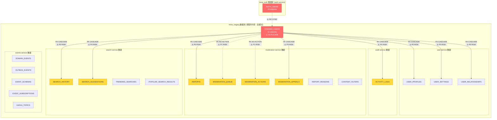

# Nova 数据库 ERD 图

**生成日期**: 2025-11-11
**数据库**: PostgreSQL 16
**范围**: nova_auth + nova_staging

---

## 完整 ERD 图

```mermaid
erDiagram
    %% ============================================
    %% nova_auth 数据库 (认证服务)
    %% ============================================

    AUTH_USERS {
        uuid id PK
        varchar username UK
        varchar email UK
        varchar password_hash
        boolean email_verified
        timestamptz email_verified_at
        boolean totp_enabled
        varchar totp_secret
        boolean totp_verified
        varchar phone_number
        boolean phone_verified
        timestamptz locked_until
        integer failed_login_attempts
        timestamptz last_login_at
        timestamptz last_password_change_at
        timestamptz created_at
        timestamptz updated_at
        timestamptz deleted_at
    }

    SESSIONS {
        uuid id PK
        uuid user_id FK
        varchar device_id
        varchar device_name
        varchar device_type
        varchar os_name
        varchar os_version
        varchar browser_name
        varchar browser_version
        inet ip_address
        text user_agent
        varchar location_country
        varchar location_city
        varchar access_token_jti UK
        varchar refresh_token_jti UK
        timestamptz last_activity_at
        timestamptz expires_at
        timestamptz revoked_at
        timestamptz created_at
        timestamptz updated_at
    }

    OAUTH_CONNECTIONS {
        uuid id PK
        uuid user_id FK
        varchar provider
        varchar provider_user_id
        varchar email
        varchar name
        varchar picture_url
        varchar access_token_encrypted
        varchar refresh_token_encrypted
        varchar token_type
        timestamptz expires_at
        text scopes
        jsonb raw_data
        timestamptz created_at
        timestamptz updated_at
    }

    TOKEN_REVOCATION {
        uuid id PK
        uuid user_id FK
        varchar token_hash UK
        varchar token_type
        varchar jti
        varchar reason
        timestamptz revoked_at
        timestamptz expires_at
        timestamptz created_at
    }

    %% nova_auth 关系
    AUTH_USERS ||--o{ SESSIONS : "has many"
    AUTH_USERS ||--o{ OAUTH_CONNECTIONS : "has many"
    AUTH_USERS ||--o{ TOKEN_REVOCATION : "has many"

    %% ============================================
    %% nova_staging 数据库 (业务数据 - 待拆分)
    %% ============================================

    STAGING_USERS {
        uuid id PK
        varchar username UK
        varchar email UK
        varchar password_hash
        varchar display_name
        text avatar_url
        text bio
        boolean is_active
        timestamptz created_at
        timestamptz updated_at
    }

    USER_PROFILES {
        uuid id PK_FK
        varchar username
        varchar email
        varchar display_name
        text bio
        text avatar_url
        text cover_url
        text website
        text location
        boolean is_verified
        boolean is_private
        integer follower_count
        integer following_count
        integer post_count
        timestamptz created_at
        timestamptz updated_at
        timestamptz deleted_at
    }

    USER_SETTINGS {
        uuid user_id PK_FK
        boolean email_notifications
        boolean push_notifications
        boolean marketing_emails
        varchar timezone
        varchar language
        boolean dark_mode
        varchar privacy_level
        boolean allow_messages
        timestamptz created_at
        timestamptz updated_at
    }

    USER_RELATIONSHIPS {
        uuid id PK
        uuid follower_id FK
        uuid followee_id FK
        varchar relationship_type
        varchar status
        timestamptz created_at
        timestamptz updated_at
    }

    ACTIVITY_LOGS {
        uuid id PK
        uuid user_id FK
        varchar activity_type
        varchar severity
        text description
        jsonb metadata
        varchar action_taken
        timestamptz created_at
    }

    REPORTS {
        uuid id PK
        uuid reporter_id FK
        uuid reported_user_id FK
        uuid reason_id FK
        varchar reason_code
        varchar target_type
        uuid target_id
        text description
        varchar status
        varchar severity
        integer priority
        timestamptz created_at
        timestamptz updated_at
        timestamptz resolved_at
    }

    REPORT_REASONS {
        uuid id PK
        varchar reason_code UK
        varchar reason_label
        text description
        timestamptz created_at
    }

    MODERATION_QUEUE {
        uuid id PK
        uuid report_id FK
        varchar queue_status
        uuid assigned_to FK
        integer priority
        timestamptz created_at
        timestamptz assigned_at
        timestamptz completed_at
    }

    MODERATION_ACTIONS {
        uuid id PK
        uuid report_id FK
        uuid moderator_id FK
        varchar action_type
        varchar target_type
        uuid target_id
        integer duration_days
        text reason
        text notes
        varchar status
        timestamptz created_at
        timestamptz expires_at
        timestamptz updated_at
    }

    MODERATION_APPEALS {
        uuid id PK
        uuid action_id FK
        uuid user_id FK
        text reason
        text supporting_info
        varchar status
        text decision_reason
        uuid reviewed_by FK
        timestamptz created_at
        timestamptz reviewed_at
    }

    CONTENT_FILTERS {
        uuid id PK
        varchar filter_type
        text filter_value
        varchar severity
        boolean is_active
        timestamptz created_at
        timestamptz updated_at
    }

    SEARCH_HISTORY {
        uuid id PK
        uuid user_id FK
        varchar query_type
        varchar query_text
        integer result_count
        timestamptz searched_at
        uuid clicked_result_id
        timestamptz clicked_at
    }

    SEARCH_SUGGESTIONS {
        uuid id PK
        uuid user_id FK
        varchar query_type
        varchar suggestion_text
        varchar suggestion_type
        float relevance_score
        integer position
        timestamptz created_at
        timestamptz expires_at
    }

    TRENDING_SEARCHES {
        uuid id PK
        varchar query_type
        varchar query_text
        integer search_count
        float trending_score
        timestamptz last_updated_at
        timestamptz updated_at
    }

    POPULAR_SEARCH_RESULTS {
        uuid id PK
        varchar query_type
        varchar query_hash
        uuid result_id
        integer click_count
        integer impression_count
        float ctr
        timestamptz last_clicked_at
        timestamptz last_updated_at
    }

    DOMAIN_EVENTS {
        uuid id PK
        varchar event_type
        varchar aggregate_id
        varchar aggregate_type
        integer event_version
        jsonb data
        jsonb metadata
        bigint sequence_number
        integer aggregate_version
        uuid correlation_id
        uuid causation_id
        varchar created_by
        timestamptz created_at
    }

    OUTBOX_EVENTS {
        uuid id PK
        varchar event_type
        varchar aggregate_id
        varchar aggregate_type
        jsonb data
        jsonb metadata
        varchar status
        integer priority
        integer retry_count
        integer max_retries
        text last_error
        varchar kafka_topic
        integer kafka_partition
        varchar kafka_key
        uuid correlation_id
        uuid causation_id
        timestamptz created_at
        timestamptz published_at
        timestamptz next_retry_at
    }

    EVENT_SCHEMAS {
        uuid id PK
        varchar event_type
        integer version
        jsonb schema_json
        text description
        jsonb example_payload
        boolean is_active
        timestamptz created_at
        timestamptz updated_at
    }

    EVENT_SUBSCRIPTIONS {
        uuid id PK
        varchar subscriber_service
        text[] event_types
        varchar endpoint
        varchar subscription_type
        boolean is_active
        timestamptz created_at
        timestamptz updated_at
    }

    KAFKA_TOPICS {
        uuid id PK
        varchar topic_name UK
        text[] event_types
        integer partitions
        integer replication_factor
        bigint retention_ms
        boolean is_active
        timestamptz created_at
        timestamptz updated_at
    }

    %% ============================================
    %% nova_staging 内部关系 (单数据库内)
    %% ============================================

    STAGING_USERS ||--o| USER_PROFILES : "has profile"
    STAGING_USERS ||--o| USER_SETTINGS : "has settings"
    STAGING_USERS ||--o{ USER_RELATIONSHIPS : "follower"
    STAGING_USERS ||--o{ USER_RELATIONSHIPS : "followee"
    STAGING_USERS ||--o{ ACTIVITY_LOGS : "generates"
    STAGING_USERS ||--o{ REPORTS : "reports as reporter"
    STAGING_USERS ||--o{ REPORTS : "reported as user"
    STAGING_USERS ||--o{ MODERATION_QUEUE : "assigned moderator"
    STAGING_USERS ||--o{ MODERATION_ACTIONS : "moderator"
    STAGING_USERS ||--o{ MODERATION_APPEALS : "appeals"
    STAGING_USERS ||--o{ MODERATION_APPEALS : "reviews"
    STAGING_USERS ||--o{ SEARCH_HISTORY : "searches"
    STAGING_USERS ||--o{ SEARCH_SUGGESTIONS : "receives"

    REPORT_REASONS ||--o{ REPORTS : "categorizes"
    REPORTS ||--o| MODERATION_QUEUE : "queued"
    REPORTS ||--o{ MODERATION_ACTIONS : "triggers"
    MODERATION_ACTIONS ||--o{ MODERATION_APPEALS : "appealed"

    %% ============================================
    %% 跨数据库关系 (问题所在 - 用虚线表示)
    %% ============================================

    AUTH_USERS -.->|"⚠️ DATA DUPLICATION"| STAGING_USERS : "should be single source"
```

---

## 问题可视化：跨服务外键依赖



**图例**:
- 🔴 红色框 = 数据重复问题
- 🟡 黄色框 = 跨服务外键约束
- 实线箭头 = CASCADE 删除策略 (高风险)
- 虚线箭头 = NO ACTION 策略 (中风险)

---

## 推荐架构：Database-per-Service

```mermaid
graph TD
    subgraph "微服务架构 (推荐)"
        subgraph "nova_auth DB"
            A1[AUTH_USERS]
            A2[SESSIONS]
            A3[OAUTH_CONNECTIONS]
            A4[TOKEN_REVOCATION]
        end

        subgraph "nova_user DB"
            U1[USER_PROFILES]
            U2[USER_SETTINGS]
            U3[USER_RELATIONSHIPS]
            U4["user_cache<br/>(缓存 auth 数据)"]
        end

        subgraph "nova_moderation DB"
            M1[REPORTS]
            M2[MODERATION_QUEUE]
            M3[MODERATION_ACTIONS]
            M4[MODERATION_APPEALS]
            M5[REPORT_REASONS]
            M6[CONTENT_FILTERS]
        end

        subgraph "nova_search DB"
            S1[SEARCH_HISTORY]
            S2[SEARCH_SUGGESTIONS]
            S3[TRENDING_SEARCHES]
            S4[POPULAR_SEARCH_RESULTS]
        end

        subgraph "nova_audit DB"
            L1[ACTIVITY_LOGS]
        end

        subgraph "nova_events DB"
            E1[DOMAIN_EVENTS]
            E2[OUTBOX_EVENTS]
            E3[EVENT_SCHEMAS]
            E4[EVENT_SUBSCRIPTIONS]
            E5[KAFKA_TOPICS]
        end
    end

    subgraph "服务间通信 (无外键)"
        AUTH_SERVICE[auth-service<br/>gRPC API]
        USER_SERVICE[user-service<br/>gRPC API]
        MOD_SERVICE[moderation-service<br/>gRPC API]
        SEARCH_SERVICE[search-service<br/>gRPC API]
        AUDIT_SERVICE[audit-service<br/>gRPC API]
        EVENT_BUS[Kafka Event Bus]
    end

    %% 服务访问自己的数据库
    AUTH_SERVICE --> A1
    USER_SERVICE --> U1
    MOD_SERVICE --> M1
    SEARCH_SERVICE --> S1
    AUDIT_SERVICE --> L1

    %% 跨服务通信通过 API
    USER_SERVICE -.->|"GetUser(user_id)"| AUTH_SERVICE
    MOD_SERVICE -.->|"CheckUserExists(user_id)"| AUTH_SERVICE
    SEARCH_SERVICE -.->|"GetUserInfo(user_id)"| AUTH_SERVICE

    %% 事件驱动同步
    AUTH_SERVICE -->|"UserCreated<br/>UserUpdated<br/>UserDeleted"| EVENT_BUS
    EVENT_BUS --> USER_SERVICE
    EVENT_BUS --> MOD_SERVICE
    EVENT_BUS --> SEARCH_SERVICE
    EVENT_BUS --> AUDIT_SERVICE

    style AUTH_SERVICE fill:#51cf66,stroke:#2f9e44,color:#fff
    style USER_SERVICE fill:#51cf66,stroke:#2f9e44,color:#fff
    style MOD_SERVICE fill:#51cf66,stroke:#2f9e44,color:#fff
    style SEARCH_SERVICE fill:#51cf66,stroke:#2f9e44,color:#fff
    style AUDIT_SERVICE fill:#51cf66,stroke:#2f9e44,color:#fff
    style EVENT_BUS fill:#339af0,stroke:#1864ab,color:#fff
```



**关键改进**:
1. ✅ 每个服务独立拥有数据库
2. ✅ 无跨服务外键约束
3. ✅ 通过 gRPC API 访问其他服务数据
4. ✅ 通过事件总线异步同步数据

---

## 数据库索引策略

### nova_auth 数据库

```sql
-- users 表 (已有索引 ✅)
CREATE INDEX idx_users_email ON users(email) WHERE deleted_at IS NULL;
CREATE INDEX idx_users_username ON users(username) WHERE deleted_at IS NULL;
CREATE INDEX idx_users_created_at ON users(created_at);
CREATE INDEX idx_users_deleted_at ON users(deleted_at);

-- sessions 表 (已有索引 ✅)
CREATE INDEX idx_sessions_user_id ON sessions(user_id);
CREATE INDEX idx_sessions_device_id ON sessions(device_id);
CREATE INDEX idx_sessions_expires_at ON sessions(expires_at) WHERE revoked_at IS NULL;
CREATE INDEX idx_sessions_last_activity_at ON sessions(last_activity_at);

-- 推荐新增索引
CREATE INDEX idx_sessions_active ON sessions(user_id, expires_at)
  WHERE revoked_at IS NULL;  -- 查询活跃会话
```

### nova_staging 数据库 (迁移前优化)

```sql
-- user_profiles 表
CREATE INDEX idx_user_profiles_username_email ON user_profiles(username, email)
  WHERE deleted_at IS NULL;  -- 用户名/邮箱查询

-- user_relationships 表
CREATE INDEX idx_user_relationships_follower_status ON user_relationships(follower_id, status, created_at DESC);
CREATE INDEX idx_user_relationships_followee_status ON user_relationships(followee_id, status, created_at DESC);

-- reports 表
CREATE INDEX idx_reports_status_priority ON reports(status, priority DESC, created_at DESC)
  WHERE status != 'dismissed';  -- 审核队列查询

-- search_history 表 (分区索引)
CREATE INDEX idx_search_history_recent ON search_history(user_id, searched_at DESC)
  WHERE searched_at > NOW() - INTERVAL '30 days';  -- 仅索引最近 30 天

-- domain_events 表 (事件溯源)
CREATE INDEX idx_domain_events_aggregate_stream ON domain_events(aggregate_type, aggregate_id, sequence_number);
```

---

## 查询性能目标

| 查询类型 | 表 | 当前 p95 | 目标 p95 | 优化方法 |
|---------|---|----------|---------|---------|
| 单用户查询 | users | 50ms | 10ms | 覆盖索引 + 连接池 |
| 活跃会话查询 | sessions | 100ms | 20ms | 条件索引 (active sessions) |
| 用户关系列表 | user_relationships | 200ms | 50ms | 复合索引 + LIMIT |
| 审核队列 | reports + moderation_queue | 150ms | 30ms | 物化视图 |
| 搜索历史 | search_history | 300ms | 100ms | 分区表 (按日期) |
| 事件溯源 | domain_events | 100ms | 20ms | sequence_number 索引 |

---

## 总结

### 当前问题
1. ❌ **数据重复**: `users` 表在 2 个数据库中存在
2. ❌ **跨服务外键**: 9 个外键约束跨越服务边界
3. ❌ **单数据库**: 多个服务共享 `nova_staging`

### 推荐架构
1. ✅ **6 个独立数据库** (每服务一个)
2. ✅ **事件驱动同步** (Kafka + domain_events)
3. ✅ **gRPC API 通信** (无直接数据库访问)

### 迁移优先级
1. **P0**: 消除 `users` 表重复 (Week 1-2)
2. **P1**: 拆分 `nova_staging` 数据库 (Week 3-6)
3. **P2**: 实现 Saga 模式 (Week 7-8)

---

**参考文档**: [DATABASE_ARCHITECTURE_ANALYSIS.md](DATABASE_ARCHITECTURE_ANALYSIS.md)
